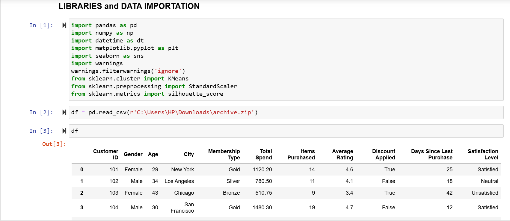
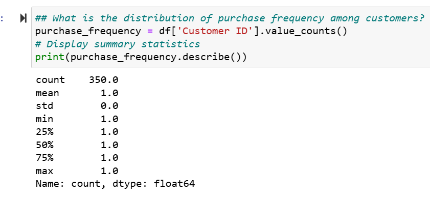
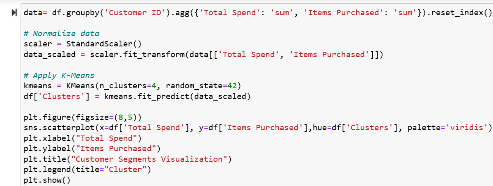

# E-COMMERCE-CUSTOMER-SEGMENTATION-ANALYSIS
## INTRODUCTION
&nbsp;&nbsp;&nbsp;&nbsp;&nbsp;This project aims to perform customer segmentation analysis for an e-commerce company using Python as the primary data analytics tool. By analyzing customer behavior and purchase patterns, the goal is to group customers into distinct segments to support targeted marketing strategies and improve customer satisfaction.  
The dataset provides a detailed view of customer transactions and interactions, offering insights into spending habits and engagement levels. This analysis will help businesses make data-driven decisions to enhance customer experience and optimize business strategies.

## PROBLEM STATEMENT
1. Descriptive Statistics
   - What is the average purchase value per customer?
   - What is the distribution of purchase frequency among customers?
   - What is the total revenue contribution of different customer groups?
2. Customer Segmentation
   - Group customers based on their purchasing behavior
3. Visualization & Insights
   - Use a scatter plot to visualize customer groups based on spending behavior
   - Use a bar chart to compare the number of customers in each segment
     
## SKILLS AND CONCEPTS DEMONSTRATED
1. Data Handling & Preprocessing
2. Descriptive Analytics
3. Customer Segmentation & Clustering
4. Data Visualization & Insights Communication
5. Business Recommendation

## STAGES TO NAVIGATE IN THE E-COMMERCE CUSTOMER SEGMENTATION ANALYSIS PROJECT

The project comprises four critical stages essential for successful completion, which encompass:
1. Libraries and Data Importation
2. Data Assessment to Detect Data Quality Issues
3. Data Cleaning
4. Data Manipulation and Data Visualization

#### EXPLANATIONS
1. "Libraries and Data Importation":
   ---
   In a Jupyter Notebook, the first step is to import the necessary libraries, as they serve as the foundation for data analysis and visualization. The following libraries were used in this case:

- Pandas (pd) – for data importation and manipulation.
- NumPy (np) – for numerical computations.
- Datetime (dt) – for handling date-related operations.
- Matplotlib.pyplot (plt) and Seaborn (sns) – for data visualization.
- Warnings – to suppress unnecessary warnings during execution.
- Scikit-learn (sklearn):
  - KMeans – for customer segmentation using clustering.
  - StandardScaler – for normalizing data before clustering.
  
Once these libraries are imported, the next step is to load the customers dataset into the Jupyter Notebook environment as a DataFrame using the pd.read_csv() function. The 
dataset is assigned to a variable named df, allowing easy reference throughout the analysis.
   
Below is a snapshot of the code snippet used for importing libraries, loading the dataset, and displaying the DataFrame.

LIBRARIES AND DATA IMPORTATION
:-----------------------------:


2. "Data Assessment to Detect Data Quality Issues":
   ---
Data assessment is a crucial step in evaluating imported data to ensure its suitability and cleanliness for analysis. In this case, a programmatic assessment was conducted using code, which is especially useful for large datasets with numerous rows and columns that cannot be manually inspected.

To assess the dataset, several Pandas functions and attributes were utilized:

- df.shape – Returns the dataset's dimensions (rows and columns). The dataset contains 350 rows and 11 columns.
- df.info() – Provides a summary of the DataFrame, including data types and memory usage. The output confirms that all columns have the correct data types.
- df.duplicated().sum() – Identifies duplicate rows. The output confirms that no duplicate records are present.
- df.isnull().sum() – Counts missing values in each column. The result shows that the Satisfaction Level column has two missing values as seen below, in the snapshot'B' 
  highlighted in a yellow rectangular shape.
- df['Satisfaction Level'].value_counts() – Examines the Satisfaction Level column to understand its unique categories and their frequencies. The results reveal three 
 distinct categories:
  - Satisfied: 125 occurrences
  - Unsatisfied: 116 occurrences
  - Neutral: 107 occurrences
    
Additionally, box plots were generated using Seaborn (sns) and Matplotlib (plt) to detect outliers in the Total Spend and Items Purchased columns. The analysis indicated that no outliers were present in either column.

Findings:  
Based on these assessments, the only detected data quality issue is the two missing values in the Satisfaction Level column..

These assessments and data quality issue detected are illustrated in the snapshots below. 
A    |B    |Findings  
:---:|:---:|:---:
||
D    |E    
|

3. "Data Cleaning":
   ---
During the data assessment, it was discovered that the Satisfaction Level column contained two missing values. To address this, two possible approaches can be used:

a. Deleting the Rows : Since only two values are missing, removing them would have a negligible impact on the analysis.  
b. Filling the Missing Values : Instead of deletion, the missing values can be categorized appropriately. Typically, missing categorical values are assigned to the most frequent category. In this case, the Satisfied category appears most often. However, since there is also a Neutral category, it is more appropriate to classify the missing values as Neutral, as the customers could either be Satisfied or Unsatisfied. 

The df['Satisfaction Level'].value_counts() function was used to analyze the column and support this decision.

To implement this solution, the fillna() function from Pandas was applied:
```python
df['Satisfaction Level'].fillna('Neutral', inplace=True)
```
After executing this code, the missing values were successfully replaced with Neutral. To confirm the change, running df['Satisfaction Level'].value_counts(), now shows that the Neutral category has 109 occurrences instead of 107, verifying that the update was effective.

The snapshots below illustrate the Satisfaction Level column before and after cleaning, highlighted in a yellow rectangular shape.
BEFORE CLEANING  |AFTER  CLEANING
:---------------:|:--------------:
|

4. "Data Manipulation and Visualization (Analysis of the Problem Statement)":
   ---
### 1, Descriptive Statistics 
#### a. What is the average purchase value per customer?
   ---
   To calculate the average purchase value per customer, follow these steps:
   - Group purchases by customer ID using the groupby function and aggregate total purchase per customer using the sum() function, then store the result in a variable 
     called customer_purchases.
   - Calculate the average purchase value by applying the mean() function to customer_purchases, storing the result in avg_purchase_value.
   - Print the result using formatted strings to display the final value.
      
   Therefore, the "Average Purchase Value per Customer is: 845.38". 
   
   The code snippet used to achieve this is shown in the snapshot below.

   Average Purchase Value Per Customer
   :-----------------------------:  
     
   
#### b. What is the distribution of purchase frequency among customers?
   ---
   To analyze the distribution of purchase frequency among customers, follow these steps:  
   - Count the occurrences of each unique Customer ID and store the result in a variable named purchase_frequency.
   - Generate summary statistics using the describe() function.
   - Print the results to understand the spread of purchase frequency.
      
   The output reveals that every customer has made exactly one purchase, as indicated by the mean, standard deviation, and quartiles all equaling 1.
   
   The snapshot below shows the code snippet used to achieve this:

   Distribution of Purchase Frequency among Customers
   :-------------------------------------------------:  
    

#### c. What is the total revenue contribution of different customer groups?
   ---
   To calculate the total revenue contribution of different customer groups, follow these steps:

   - Group customers by Customer ID and aggregate their total revenue using the sum() function, storing the result in a variable called customer_revenue.
   - Define spending categories based on quantiles (['Low', 'Medium', 'High', 'VIP']) and classify customers accordingly, storing the categorized data in the variable 
     customer_revenue_groups.
   - Create a DataFrame to display the total revenue contribution of each customer group and store it in the variable (revenue_by_group).
   - Print revenue_by_group to analyze the distribution of revenue across different segments.
   The output is as follows:

   Customer Group  | Total Spend            
  :---------------:|:--------------:
  Low              |40,544.9
  Medium	          |55,181  
  High             |83,400.5
  VIP              |116,757.2

  The code snippet used to achieve this is shown in the snapshot below.
  
  Total Revenue Contribution of Different Customer Groups
   :-----------------------------------------------------:  
    

### 2, Customer Segmentation
#### a. Group customers based on their purchasing behavior
   ---
   There are several techniques for customer segmentation based on purchasing behavior. One of the most effective methods is Customer Clustering using K-Means, which helps identify hidden customer groups based on spending patterns.

To achieve accurate segmentation, follow these steps:
- Group the dataset by Customer ID, select and aggregate relevant columns (e.g., Total Spend, Items Purchased) and store them in a variable called data.
- Normalize the data to ensure fair clustering.
- Apply K-Means clustering to identify distinct customer segments.

Interpretation of Customer Segments (0–3)  
Based on the clustering results, customers are categorized as follows:
- Group 0 – Low spenders, infrequent buyers.
- Group 1 – Mid-tier customers.
- Group 2 – High-value customers.
- Group 3 – Occasional big spenders.  
Therefore, the top five customer segments based on their purchasing behavior are:
- Customer 101 → Mid-tier customer.
- Customer 102 → High-value customer.
- Customer 103 → Low spender / infrequent buyer.
- Customer 104 → Occasional big spender.
- Customer 105 → High-value customer.

The snapshot below contains the code snippet for K-Means clustering along with the resulting segment assignments.
 Customers Based on their Purchasing Behavior  
 :------------------------------------------:  
 

### 3, Visualization and Insights
#### a. Use a scatter plot to visualize customer groups based on their spending behavior.
   ---
  To visualize customer groups based on spending behavior, a scatter plot is one of the most effective approach. In this case, we will plot Total Spend against Items Purchased. However, since our dataset lacks a Cluster column for color differentiation (hue), we must first apply K-Means clustering to segment the customers before visualizing the results.  
Steps to Achieve This:  
- Group the dataset by Customer ID and aggregate relevant columns (e.g., Total Spend, Items Purchased), storing them in a variable called data.
- Normalize the data to ensure fair clustering.
- Apply K-Means clustering to segment customers into distinct groups.  

Below is the code snippet used to implement this, along with the resulting output shown in the snapshot.

Scatter Plot Analysis  |Scatter Plot Visualization
:--------------------: |:--------------:
|

Cluster Interpretations:
- Lower left (bottom-left): These are customers who made low purchases and spent less (low-value customers).
- Middle region: These are customers with moderate spending and purchases (mid-tier customers).
- Upper right (top-right): These are customers who spent a lot(likely high-value or VIP customers).

Insights from Clusters:
- Groups closer together indicate similar purchasing behavior.
- Customers in the same cluster (same color) have similar spending habits.
- Higher-spending clusters are likely to be loyal or high-value customers, while lower-spending clusters might need engagement strategies.

#### b. Use a bar chart to visualize customer groups based on their spending behavior.
   ---
   To compare the distribution of customers across different segments, a bar chart is used. This visualization effectively highlights the number of customers in each segment.

The code and output for this analysis are shown in the snapshot below: 
Bar Chart Analysis  |Bar Chart Visualization
:---------------:|:--------------:
|

Interpretation:  
- Segments 0 & 1 (Largest Groups):  
  These segments consist of low or mid-tier customers, making up the majority of the customer base. Customers in these groups tend to spend less or purchase infrequently.

- Segments 2 & 3 (Smaller Groups):  
  These segments represent high-value or VIP customers who made large purchases. Despite being fewer in number, their contribution to total revenue is highly significant.

## RECOMMENDATION
Based on the customer segmentation analysis, the following strategic recommendations can be made:

1. Personalized Marketing Strategies:
- Focus on VIP and high-value customers (Segments 2 & 3) with loyalty programs, exclusive discounts, and premium services to retain them and increase their spending.
- Engage low and mid-tier customers (Segments 0 & 1) with targeted promotions, bundle deals, and email campaigns to encourage more frequent purchases.
2. Customer Retention Initiatives:
- Offer personalized recommendations based on purchase history to increase engagement.
3. Pricing and Product Strategy:
- Analyze purchasing patterns of different customer segments to adjust pricing strategies and product offerings accordingly.
- Stock more of the products that VIP customers frequently purchase while ensuring affordability for mid-tier and low-tier customers.
4. Improve Customer Experience:
- Provide excellent customer service to VIPs while also improving the overall buying experience for all customers.
- Use feedback from different segments to enhance service quality and customer satisfaction.

## CONCLUSION
This project successfully utilized K-Means clustering to segment customers based on their purchasing behavior, revealing distinct groups ranging from low spenders to high-value customers. The analysis provided actionable insights into how different customer groups contribute to overall revenue and how businesses can tailor their strategies to maximize profitability.  
By leveraging data-driven segmentation, businesses can enhance customer engagement, optimize marketing efforts, and improve customer retention. Future work could include time-series analysis to identify seasonal trends or incorporating additional behavioral metrics for more refined segmentation.


   

   
  


 


